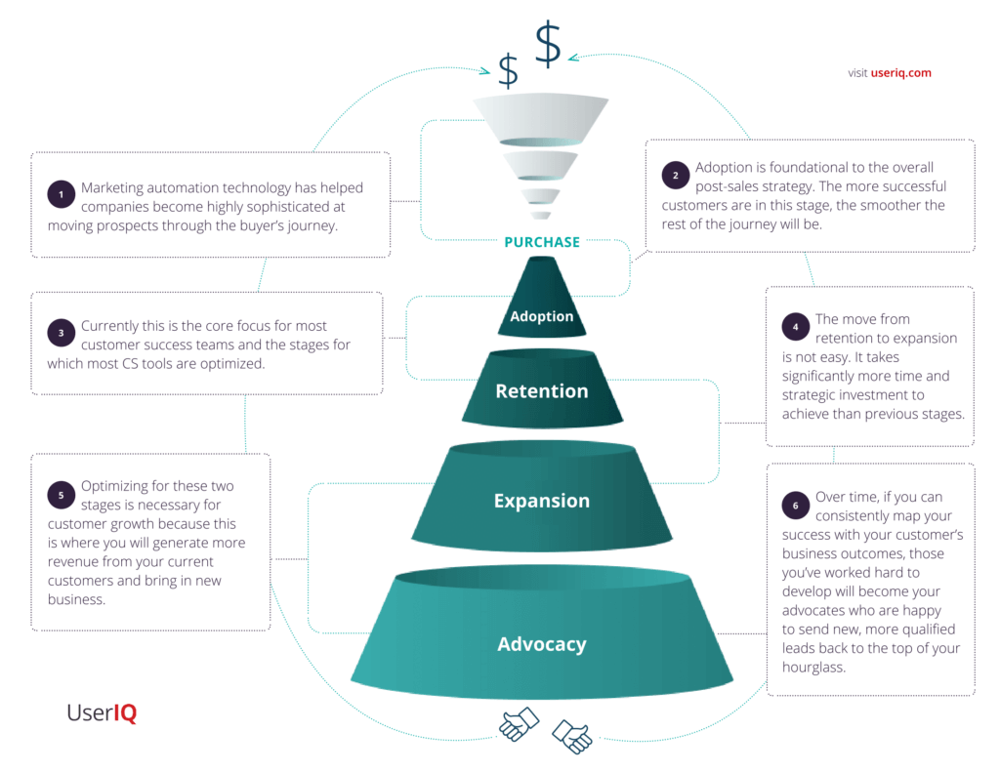
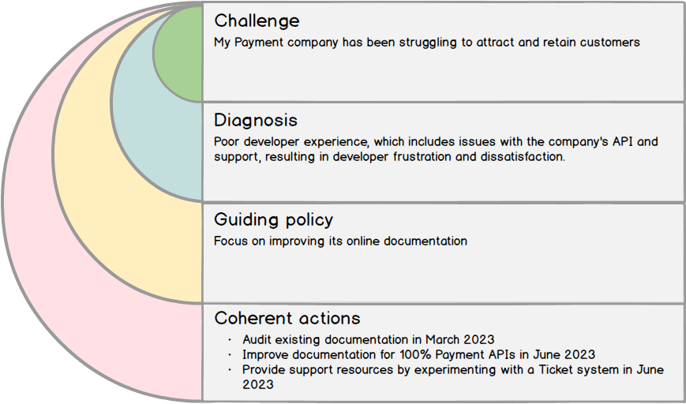
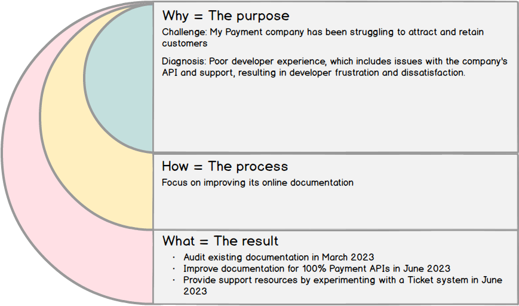
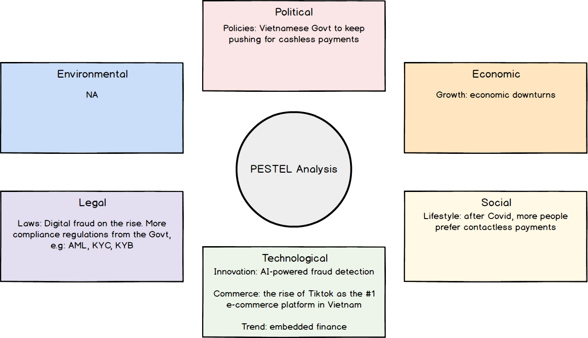
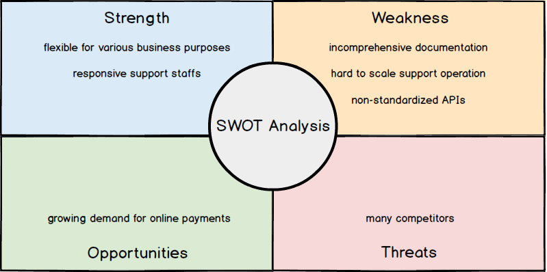

As part of my company's effort to streamline the integration process with its Payment APIs, I was assigned the task of improving the existing documentation. Through discussions with stakeholders and merchant partners, I came to realize that there was a broader goal of enhancing Merchant Success funnel. Improving the documentation was a crucial first step in the adoption phase towards this goal.

*A funnel for Merchant/Consumer Success*

I personally believe that there is a pressing need to develop a strategy to systematically embrace the challenge above. This is the first post in a series of articles that will document my personal journey in Strategic Planning to create an executable plan.

Let's first start with Strategy in general.

## Strategy

I read the book `Good Strategy, Bad Strategy`  by UCLA Anderson School of Management professor Richard P. Rumelt, takes a nebulous concept and makes it concrete. 

This book demystifies strategy. For example, just setting an ambitious goal is not a strategy. A strategy is a coherent set of analyses, concepts, policies, arguments, and actions that respond to a challenge. Richard believes an effective strategy must address a significant challenge, as it provides a clear reason for stakeholders to take action and is closely connected to the strategy's purpose. Without a significant challenge, a strategy lacks purpose and is unlikely to be effective.

He explains what goes into developing a strategy, what makes a strategy good, and what makes a strategy bad. A good strategy has the "kernel" containing three main components:

- `Diagnosis` is the process of identifying the root causes of a challenge. It involves understanding the underlying dynamics and trends that are driving the situation, as well as the key constraints and opportunities that exist.
- A `guiding policy` is an overall approach chosen to cope with or overcome the obstacles identified in the diagnosis. Like the guardrails on a highway, the guiding policy directs and constrains action in certain directions without defining exactly what shall be done.
- A set of `coherent actions` dictate how the guiding policy will be carried out. The actions should be coherent, meaning the use of resources, policies, and maneuvers that are undertaken should be coordinated and support each other (not fight each other, or be independent from one another). Personally I like the actions to be expressed in OKR style to drive alignment in executions, to measure if our strategy works or not.

A bad strategy lacks one or more of those items. A bad strategy is often just “positive thinking.” A bad strategy has a lack of focus and tries to please everyone. A bad strategy is full of “fluff” (a Rumelt formal term).

An example strategy for my above challenge may look like

IMHO From another perspective, the kernel shares some similarities with the  Golden Circle of Thinking, a framework for effective communication and leadership developed by Simon Sinek. By starting with Why, they can inspire others to take action and create a sense of shared purpose and meaning. The How and What layers provide the necessary context and details to bring the Why to life, but they are secondary to the central purpose that drives everything else.

## Analysis

> "A problem well-stated is a problem half-solved.", Charles Kettering

A good diagnosis is a critical first step in developing a good strategy. It also goes beyond surface-level symptoms to identify the underlying causes of the problem, which requires careful analysis and research to understand the root causes.

Strategy analysis helps develop a comprehensive understanding of the organization and its environment. It involves breaking down the problem into its constituent parts and examining how they interact, as well as identifying patterns, trends, and relationships that can inform decision-making. There are many analysis for different purposes, for example:

- to analyze environment, we can use PESTEL Analysis

- to analyze organization, SWOT analysis can be a good choice.

- for innovation and growth, Blue Ocean Strategy or McKinsey's Three Horizons can be a good start.

## Paralysis

> “All models are wrong, some are useful”, George Box.

Designing a strategy can be a challenge because too much analysis can lead to [paralysis](https://en.wikipedia.org/wiki/Analysis_paralysis), a situation in which an individual or organization becomes so focused on analyzing data and information that they are unable to make a decision or take action. 

Analysis is a tool we use to model and understand the world from different perspectives. However, these models can sometimes overlap or be incompatible with each other. As a newcomer to this field, I found myself trying to combine **uncoordinated** analyses to create a comprehensive and realistic description of the current situation. Unfortunately, this often led to overcomplicated and confusing thoughts that were difficult to communicate effectively to others. 

## Communication

> "Culture eats strategy for breakfast", Peter Drucker

Aligning a team around a strategy plan is also another challenge. For a strategy to be effectively implemented, team members must understand it. However, when the plan is put into action, things can become messy and changes are inevitable. Throughout our journey as a team or organization, we will test many things and learn what works and what doesn't. With this feedback, we can leverage the collective wisdom of the crowd to adjust the strategy accordingly, as long as everyone understands how the plan was created.

However, strategy plans can often be overwhelming, with large and complex documents that can leave people feeling lost. When presenting these plans, engineers might feel like they are hearing a foreign language, making it difficult to incorporate the plan into their day-to-day work. As a result, employees may not be using the plan to inform their decisions.

## Conclusion

The book "Good Strategy, Bad Strategy" provides a clear picture of what a good strategy should look like, but it does not describe a methodology for creating one. I am in need of a strategy-formulation methodology that can help me systematically solve challenges and avoid the paralysis of analysis. Additionally, I require a methodology that is easy to understand and communicate to engineering personnel, in order to gain their support.

Luckily, I have discovered Wardley Mapping, an innovative approach that combines Eastern wisdom with Western science. In my next post, I will discuss how I applied this methodology to enhance the developer experience of the Payment APIs.